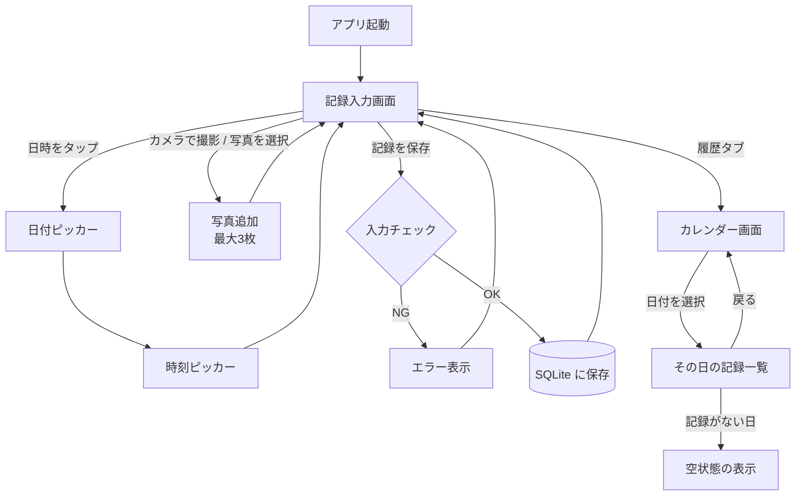

- 画面遷移を Mermaid で 1 枚にまとめる
- 画面を増やすときのルールを書く
- 戻る動作の扱いを書く
- 決めていないことは `TODO: 要確認` と書く
- 入力画面と履歴画面の行き来の方法は `TODO: 要確認`
- 一覧の並び順は `TODO: 要確認`
- 記録の編集可否は `TODO: 要確認`
- 記録の削除可否は `TODO: 要確認`

```mermaid
flowchart TD
A[アプリ起動] --> B[記録入力画面]
B -->|日時をタップ| B1[日付ピッカー] --> B2[時刻ピッカー] --> B
B -->|カメラで撮影 / 写真を選択| B3[写真追加\n最大3枚] --> B
B -->|記録を保存| C{入力チェック}
C -->|NG| B4[エラー表示] --> B
C -->|OK| D[(SQLite に保存)] --> B
B -->|履歴タブ| E[カレンダー画面]
E -->|日付を選択| F[その日の記録一覧]
F -->|記録がない日| F1[空状態の表示]
F -->|戻る| E
```
