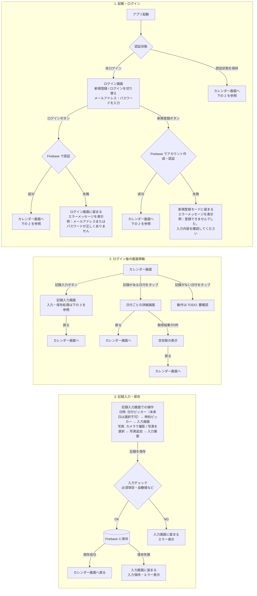

## 要件定義へのリンク

以下はこのファイルを基準とした相対パス。画面ごとの入力・表示要件はリンク先を正とし、このファイルでは画面遷移を定義する。

| 対象 | 要件定義の相対パス |
|---|---|
| 共通（目的・技術・対象範囲・完成条件） | [requirements-definition/common.md](requirements-definition/common.md) |
| ログイン画面（新規登録切り替えを含む） | [requirements-definition/login.md](requirements-definition/login.md) |
| カレンダー画面 | [requirements-definition/calendar.md](requirements-definition/calendar.md) |
| 記録入力画面 | [requirements-definition/record-input.md](requirements-definition/record-input.md) |
| 日付ごとの詳細画面 | [requirements-definition/daily-detail.md](requirements-definition/daily-detail.md) |

## 画面遷移のルール

- 画面遷移を Mermaid で 1 枚にまとめる
- 画面を増やすときは `requirements-definition/` に要件定義を置き、上の表と Mermaid 図を更新する
- 戻る動作の扱いを書く
- 決めていないことは `TODO: 要確認` と書く
- ログイン画面内で「新規登録」と「ログイン」を切り替える（別画面への遷移ではない）
- ログイン成功後、または新規登録・認証成功後はカレンダーへ遷移し、戻る操作でログイン画面へ戻さない
- カレンダーの記録入力ボタンから入力画面へ進み、戻る操作でカレンダーへ戻る
- 日付ごとの詳細画面から戻る操作でカレンダーへ戻る
- TODO: 要確認 — カレンダー画面での端末の戻る操作
- 入力画面の保存後・未保存時の動作、一覧の並び順、編集・削除可否は各画面の要件定義で管理する
- Firebase の採用理由: ユーザー指定により、ログインと記録保存を Firebase で扱う仕様へ変更する

## 図の読み方

上から「ログイン」「ログイン後の画面移動」「記録入力・保存」の順に読む。
線の交差を避けるため、同じ画面を遷移先として再掲している。同名の箱は同じ画面を指し、新しい画面ではない。
エラー時の「入力画面に留まる」も画面遷移ではなく、その場での表示更新を表す。

